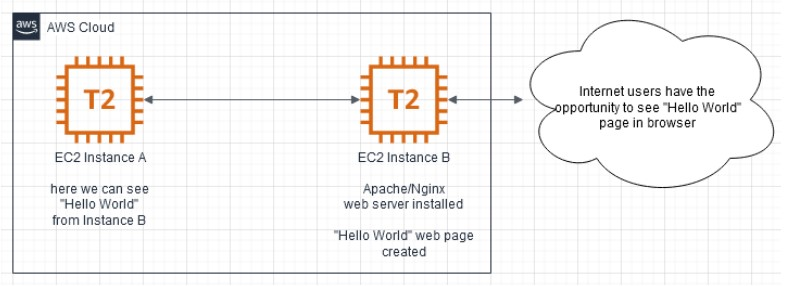

# Exadel devOps Sandbox

## Task 1:
### Description 
Git/GitHub 
Additional information (optional):
Read about Git https://git-scm.com/doc. Pay attention to the branching strategies.
The “ADV-IT” YouTube channel is recommended (RU).
Read about SSH keys.
Read about Markdown syntax.
Explore pricing policy and your personal billing plan (GitHub).
For better understanding complete this course https://learngitbranching.js.org/?locale=ru_RU
 
### Tasks (mandatory):
1. Create a Github account(if you don’t have one).
2. Create a new Github repository.
3. Create a “Task1” folder in the master branch. Create and push ./Task1/README.md file.
4. Create a new branch dev. Create and push any test file.
5. Create a new branch %USERNAME-new_feature.
6. Add ./README.md file to your %USERNAME-new_feature branch
7. Check your repo with git status command
8. Add .gitignore file to ignore all files whose name begins "."
9. Commit and push changes to github repo.
10. Create Pull Request to the dev branch.
11. Merge your branch with the dev branch and create Pull Request to the master(main) branch. Merge dev with master(main).
12. Checkout to %USERNAME-new_feature, make changes in README.md and commit them. Revert last commit in %USERNAME-new_feature branch.
13. Check your repo with git log command, create log.txt file in master(main) branch and save “git log” output in it.
14. Delete local and remote branch %USERNAME-new_feature.
    1. Add all used commands to the git_commands.md file in the dev branch.
    2. Send the link to your Git Repository to your mentor via private Skype message.

For convenience, please follow to the folder structure on the picture. 

### EXTRA (optional)*:
1. Read about GitHub Actions. What environment variables can be created?
   Create your workflow, what consists of two jobs and contain requirements according the scheme below:

2. Workflow variables should contain two variables: 
    DEPLOY_VER - should contains SHA;
    YEAR - any year as you choose
    First job should:
        Step should:
            Print the list of files/directories in your github repository.
            Print content of your log.txt file.
            Print: "Hello from "your DEPLOY_VER variable’s content" commit"

    Second job should:
    Run  after the First job is finished.
    Contain variable MONTH- any month as you choose
        Step should:
            Contain variable DAY__OF_THE_MONTH - any day number as you choose.
            Print the system date and time
            Print your variable’s content:
                Day - "DAY__OF_THE_MONTH";
                Month - " MONTH";
                Year - "YEAR".

3. Imagine that you keep in secret your favorite day of week (FAVORITE_DAY_OF_WEEK) and don’t want to share it with anyone. So where will you define it?
    Print: "My favorite day of week is "content of FAVORITE_DAY_OF_WEEK""

    What result did you get and why?

### Resultes
All the necessary commands are in [log.txt](./log.txt).
In the second task, we created 2 jobs, and added env to the required levels, 
created a secret (in settings) and then displayed everything via echo in accordance with the assignment. 

## Task 2:
### Description 
1. Important moments:
2. Read about Cloud Services. Pros and Cons, Cloud VS Bare Metal infrastructure?
3. Read about Region, Zone in AWS. What are they for? Which one will you use and why?
4. Read about Security best practices in IAM.
5. Read about AWS EC2, what is it, what is it useful for?
6. Read about AWS VPC (SG, Route, Internet Gateway).
7. Read about AWS Cloud storage, Route 53, CloudFront and CloudWatch.
    If you sign up in AWS for the first time, you will have the opportunity to use SOME AWS services for free (free tier) for 1 year. To register, you need a credit card from which it will be debited and returned 1-2$.
8. Read about AWS Free Tier. Be aware what is free for new users and what is paid by your own money. Be sure and attentive.
9. Pay attention to the Billing & Cost Management Dashboard in your account.

### Tasks (mandatory):
1. Sign up for AWS, familiarize yourself with the basic elements of the AWS Home Console GUI.
2. Explore AWS Billing for checking current costs. 
3. Create two EC2 Instance t2.micro with different operating systems (Amazon linux / Ubuntu ...). Try to stop them, restart, delete, recreate.
4. Make sure there is an SSH connection from your host to the created EC2. What IP EC2 used for it?
5. Make sure  ping and SSH are allowed from one instance to another in both ways. Configure SSH connectivity between instances using SSH keys.
6. Install web server (nginx/apache) to one instance; 
    - Create a web page with the text “Hello World” and additional information about OS version, free disk space,  free/used memory in the system and about all running processes;
    - Make sure your web server is accessible from the internet and you can see your web page in your browser; 
    - Make sure on the instance without nginx/apache you also maysee the content of your webpage from the instance with nginx/apache.

### EXTRA (optional): 
1. Run steps 3-6 with instances created in different VPC. (connectivity must be both external and internal IP)	
2. Write BASH script for installing web server (nginx/apache) and creating web pages with text “Hello World”, and information about OS version
3. Run step.6 without “manual” EC2 SSH connection.

### EXTRA (optional optional):
1. Make a screenshot only of your web page сontent from your browser.
2. Create your S3 bucket and place your screenshot there.
3. Make your screenshot visible on the internet for everyone and make sure it works.
 
As a result of this task there should be a link in your github on your “Hello World” web page. After a task check by your mentor, the instance may be deleted. EXTRA tasks are passed to mentors individually. 

### Resultes
[My site](http://44.202.151.155/)

### Implementation Steps
[Task2 README](./Task2/README.md)

## Task3
### Tasks:
1. Create EC2 Instance t2.micro
    -Ubuntu
    -CentOS
Both instances must have a tag with names. 
2. EC2 Ubuntu must have Internet access, there must be incoming access: ICMP, TCP/22, 80, 443, and any outgoing access. 
3. EC2 CentOS should not have access to the Internet, but must have outgoing and incoming access: ICMP, TCP/22, TCP/80, TCP/443 only on the local network where EC2 Ubuntu, EC2 CentOS is located. 
4. On EC2 Ubuntu, install a web server (nginx/apache);
   -Create a web page with the text “Hello World” and information about the current version of the operating system. This page must be visible from the Internet. 
5. On EC2 Ubuntu install Docker, installation should be done according to the recommendation of the official Docker manuals 
 
### EXTRA:
6. Complete  step 1, but AMI ID cannot be hardcoded. You can hardcode operation system name, version, etc. 
7. Step 3 read as: 
EC2 CentOS should have outgoing and incoming access: ICMP, TCP/22, TCP/80, TCP/443, only to EC2 Ubuntu. 
8. On EC2 CentOS install nginx (note. Remember about step 7, the task can be done in any way, it is not necessary to use terraform)
-Create a web page with the text “Hello World”. This page must be visible from the  EC2 Ubuntu.

The result of steps.1-7. is a terraform files in your GitHub. +file with output terraform plan BEFORE creating infrastructure.
The result of step EXTRA 8, is or scripts (if you have one), or an explanation of how this can be implemented.

### Solution
[basic and extra](Task3/README.md)

## Tasks4
1. Install docker. (Hint: please use VMs or Clouds  for this.)
EXTRA 1.1. Write bash script for installing Docker. 
 
2. Find, download and run any docker container "hello world". (Learn commands and parameters to create/run docker containers.
EXTRA 2.1. Use image with html page, edit html page and paste text: <Username> 2022
 
3. 3.1. Create your Dockerfile for building a docker image. Your docker image should run any web application (nginx, apache, httpd). Web application should be located inside the docker image. 
EXTRA 3.1.1. For creating docker image use clear basic images (ubuntu, centos, alpine, etc.)
3.2. Add an environment variable "DEVOPS=<username> to your docker image 
EXTRA 3.2.1. Print environment variable with the value on a web page (if environment variable changed after container restart - the web page must be updated with a new value)
 
4. Push your docker image to docker hub (https://hub.docker.com/). Create any description for your Docker image. 
EXTRA 4.1. Integrate your docker image and your github repository. Create an automatic deployment for each push. (The Deployment can be in the “Pending” status for 10-20 minutes. This is normal).
 
 
5.  Create docker-compose file. Deploy a few docker containers via one docker-compose file. 
first image - your docker image from the previous step. 5 nodes of the first image should be run;
second image - any java application;
last image - any database image (mysql, postgresql, mongo or etc.).
Second container should be run right after a successful run of a database container.
	EXTRA 5.1. Use env files to configure each service.

 
The task results is the [docker/docker-compose](Task4/docker/docker-compose/) files in your GitHub repository

### Solution
[basic and extra](Task4/README.md)

## Tasks5
1. Deploy three virtual machines in the Cloud. Install Ansible on one of them (control_plane).
2. Ping pong - execute the built-in ansible ping command. Ping the other two machines.
3. My First Playbook: write a playbook for installing Docker on two machines and run it.
       
1. EXTRA 1. Write a playbook for installing Docker and one of the (LAMP/LEMP stack, Wordpress, ELK, MEAN - GALAXY do not use) in Docker.
2. EXTRA 2. Playbooks should not have default creds to databases and/or admin panel.
3. EXTRA 3. For the execution of playbooks, dynamic inventory must be used (GALAXY can be used).

### Solution
[basic and extra](Task5/README.md)