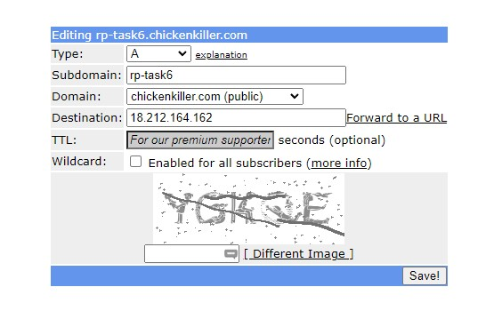

## Task6
Использовал AWS cloud 
желаемая инфраструктура: [смотреть Task5](../Task5/README.md)
- масте VM используется толко для запуска playbook на ней ничего не установленно кроме Ansible
- нода 1 будет использованна для Jenkins и агентов
- нода 2 будет использованна для запуска Docker registry 
- меняем terraform и добавляем в security group ingress tcp 50000
- после деплоймента инфраструктуры ручками(так как не захотел выносить первую ноду в отдельный терраформ блок) меняем размер root volume первой ноды на 12GB
потом логинимся через pytty на node1 и синхронизируем размер диска с файловой системой и создаем swapfile
```
sudo su -
growpart /dev/xvda 1
resize2fs /dev/xvda1
fallocate -l 512M /swapfile
mkswap /swapfile
chmod 600 /swapfile
swapon /swapfile
```

#### Конфигурация Docker на VM 1(перед первым шагом)
запуск сервиса Docker-а надо изменить чтобы его сокет был доступен на внутреннем интерфейсе VM по TLS
берем инструкцию из [Protect the Docker daemon socket](https://docs.docker.com/engine/security/protect-access/)
последовательно выполняем команды для создания сертификатов: 
```
export HOST=10.20.1.229
openssl genrsa -aes256 -out ca-key.pem 4096
openssl req -new -x509 -days 365 -key ca-key.pem -sha256 -out ca.pem
openssl genrsa -out server-key.pem 4096
openssl req -subj "/CN=$HOST" -sha256 -new -key server-key.pem -out server.csr
echo subjectAltName = IP:$HOST,IP:127.0.0.1 >> extfile.cnf
echo extendedKeyUsage = serverAuth >> extfile.cnf
openssl x509 -req -days 365 -sha256 -in server.csr -CA ca.pem -CAkey ca-key.pem   -CAcreateserial -out server-cert.pem -extfile extfile.cnf
openssl genrsa -out key.pem 4096
openssl req -subj '/CN=client' -new -key key.pem -out client.csr
echo extendedKeyUsage = clientAuth > extfile-client.cnf
openssl x509 -req -days 365 -sha256 -in client.csr -CA ca.pem -CAkey ca-key.pem   -CAcreateserial -out cert.pem -extfile extfile-client.cnf
rm -v client.csr server.csr extfile.cnf extfile-client.cnf
chmod -v 0400 ca-key.pem key.pem server-key.pem
chmod -v 0444 ca.pem server-cert.pem cert.pem
ls -la
mkdir docker
mkdir client
cp ca.pem client
cp ca.pem docker
mv server-cert.pem docker
mv server-key.pem docker
mv key.pem client
mv cert.pem client
ls -la client
ls -la docker
mkdir ca
mv ca-key.pem ca
mv ca.* ca
ls -la ca
sudo chown -R root:root ca docker
ls -la
sudo chown -R 1000:1000 client
```
копируем файл
```
sudo cp /usr/systemd/system/docker.service /etc/systemd/system/
```
создаем папку для будующей установки Jenkins и копируем туда папки с сертификатами 
```
sudo mkdir -p /opt/jenkins/data
sudo cp -r docker /opt/jenkins/data
sudo cp -r client /opt/jenkins/data
```
меняем службу запуска /etc/systemd/system/docker.service 
в ExecStart добавяем tls параметры и сокет (tcp://10.20.1.229:2376)
```
ExecStart=/usr/bin/dockerd -H fd:// --containerd=/run/containerd/containerd.sock -H tcp://10.20.1.229:2376 --tlsverify --tlscacert=/opt/jenkins/data/docker/ca.pem --tlscert=/opt/jenkins/data/docker/server-cert.pem --tlskey=/opt/jenkins/data/docker/server-key.pem

```
перезапускаем службу Docker
```
sudo systemctl daemon-reload
sudo systemctl restart docker
```
#### регистрация доменного имени 
создаем учетную записть на сайте [freeDNS](https://freedns.afraid.org/)
создаем записть A 

Т.К в РБ DNS записи не обновляются долго, то идем в блокнот(запуск от имени админа)
открываем файл hosts (путь: C:\Windows\System32\drivers\etc) и добавляем в конец файла:
```
18.212.164.162 rp-task6.chickenkiller.com
```
проверяем доступен ли хост по доменному имени на виртуалке 
```
ubuntu@ip-10-20-1-229:~$ ping rp-task6.chickenkiller.com
PING rp-task6.chickenkiller.com (18.212.164.162) 56(84) bytes of data.
64 bytes from ec2-18-212-164-162.compute-1.amazonaws.com (18.212.164.162): icmp_seq=1 ttl=63 time=0.450 ms
64 bytes from ec2-18-212-164-162.compute-1.amazonaws.com (18.212.164.162): icmp_seq=2 ttl=63 time=0.471 ms
64 bytes from ec2-18-212-164-162.compute-1.amazonaws.com (18.212.164.162): icmp_seq=3 ttl=63 time=0.562 ms
```
#### compose.yml
создаем папку ansible на VM1 для разработки [doceker compose file](./ansible/compose.yml)
защищаем Jenkins service с помощью nginx reverse proxy 
```
  nginx:
    image: nginx:1.23.0-alpine

    restart: unless-stopped
    volumes:
      - ./data/nginx:/etc/nginx/conf.d
      - ./data/certbot/conf:/etc/letsencrypt
      - ./data/certbot/www:/var/www/certbot
    ports:
      - "80:80"
      - "443:443"
    command: "/bin/sh -c 'while :; do sleep 6h & wait $${!}; nginx -s reload; done & nginx -g \"daemon off;\"'"
```
параметры для reverse proxy из [документации Jenkins](https://www.jenkins.io/doc/book/system-administration/reverse-proxy-configuration-nginx/)
так как letsencrypt будет использован для домена то [находим инструкцию и делем по ней](https://pentacent.medium.com/nginx-and-lets-encrypt-with-docker-in-less-than-5-minutes-b4b8a60d3a71)
и совмещаем информацию из этих двух статей в один [nginx конфиг](./ansible/data/nginx/app.conf)


добавляем certbot в сервисы
```
  certbot:
    image: certbot/certbot
    restart: unless-stopped
    volumes:
      - ./data/certbot/conf:/etc/letsencrypt
      - ./data/certbot/www:/var/www/certbot
    entrypoint: "/bin/sh -c 'trap exit TERM; while :; do certbot renew; sleep 12h & wait $${!}; done;'"
```
меняем [init-letsencrypt.sh](./ansible/init-letsencrypt.sh) и добавялем наш домен в строку 3
```
domains=(rp-task6.chickenkiller.com)
```


добавляем сервис Jenkins в compose file
```
jenkins:
    restart: on-failure:10
    image: jenkins/jenkins:2.358
    ports:
      - 8080:8080
      - 50000:50000
    container_name: jenkins
    volumes:
      - ./data/jenkins_configuration:/var/jenkins_home
```


генерируем SSH ключ для агентов jenkins
```
ssh-keygen -f ~/.ssh/node2
```
берем публичный ключ и добавляем в агентов 
```
agent1:
    image: jenkins/ssh-agent:latest
    ports:
      - 2022:22
    environment: 
      DOCKER_HOST: tcp://10.20.1.229:2376
      DOCKER_TLS_VERIFY: 1
      JENKINS_AGENT_SSH_PUBKEY: |
        ssh-rsa AAAAB3NzaC1yc2EAAAADAQABAAABgQC/66b/gMrDWpUZjzLeIdtawLoykg7Ss1fjQDZSx0h4T5n2R69QjfrD9iA0TVl2Auwn24oaWOKZrLgy/dLiftgf3gYDM2WaJgXpZi7WPM3S7mF/mWoDKT9o/p9IMWDYXg/dw5tee48yjnvjtkiz6MFfhVUEbS5T/sILkrpNxvzowiVaXujgErXvNKO3ax/Oa3Km27GdFOeN0LX1mVCbwzglIasaP3hZlib8iP7K3LSKL1hKAgC9qcZdYv6hEqD/A+7w5OIUHUVldHpSc//gR6u47WmJqZNvfOWyi0UCCQA4q+A6/rp1MuXsB95dexN/N+cbLcmc1kZEplR4Oi+vDb4BY8TNBHqi3+SwMhuQfpYU5YgkqiArJ/bdyKfo6SdU4zrwfxXJhT6C8nnwjMvirrGsjuUzXHAH7y1QJYDgDpwUW3Tp5Hh/susTPoQK5Iw9VYTlQWCaJJwdsWdK3F65Lu+upsOdE76fFnrXotuCoKQMJhdPKx71Pb8+fx5R1L44vXE= jenkins
    volumes:
      - ./data/client:/home/jenkins/.docker
  docker-agent2:
    restart: unless-stopped
    image: my-docker-agent:1
    build:
      context: "./data/my-docker-agent"
    ports:
      - 2023:22
    environment: 
      DOCKER_HOST: tcp://10.20.1.229:2376
      DOCKER_TLS_VERIFY: 1
      JENKINS_AGENT_SSH_PUBKEY: |
        ssh-rsa AAAAB3NzaC1yc2EAAAADAQABAAABgQC/66b/gMrDWpUZjzLeIdtawLoykg7Ss1fjQDZSx0h4T5n2R69QjfrD9iA0TVl2Auwn24oaWOKZrLgy/dLiftgf3gYDM2WaJgXpZi7WPM3S7mF/mWoDKT9o/p9IMWDYXg/dw5tee48yjnvjtkiz6MFfhVUEbS5T/sILkrpNxvzowiVaXujgErXvNKO3ax/Oa3Km27GdFOeN0LX1mVCbwzglIasaP3hZlib8iP7K3LSKL1hKAgC9qcZdYv6hEqD/A+7w5OIUHUVldHpSc//gR6u47WmJqZNvfOWyi0UCCQA4q+A6/rp1MuXsB95dexN/N+cbLcmc1kZEplR4Oi+vDb4BY8TNBHqi3+SwMhuQfpYU5YgkqiArJ/bdyKfo6SdU4zrwfxXJhT6C8nnwjMvirrGsjuUzXHAH7y1QJYDgDpwUW3Tp5Hh/susTPoQK5Iw9VYTlQWCaJJwdsWdK3F65Lu+upsOdE76fFnrXotuCoKQMJhdPKx71Pb8+fx5R1L44vXE= jenkins
    volumes:
      - ./data/client:/home/jenkins/.docker
```
в агентах папку с tls ключами монтируем как volume 


создаем архив папки ansible с сохранением под sudo чтобы сохранились права 
архив назывем jenkins.tgz


### Шаг1
логинимся на мастер ноду
``` 
git clone https://github.com/RamanPitGit2/Repo-for-Tasks.git
cd Repo-for-Tasks
gti checkout Task6
cd Task6\playbook
```
копируем jenkins.tgz в Task6/playbook/files
запускаем playbook
```
ansible-playbook -i inventory jenkins.yaml
```

### Шаг2
открываем https://rp-task6.chickenkiller.com/pluginManager/ и устанавливаем нужные плагины:) что-то там с ssh,docker,summary report

### Шаг3
- агенты запущены при усановке jenkins в docker compose 
- настраиваем их в manage jenkins -> manage nodes and cloudes -> new node -> permanent aget 
- и добавляем порт для первого агента из docker compose 
- добавляем ssh ключ как секрет 
- указыем путь к java и домашнему каталогу 
- задаем label = nоde1
- выбираем usage = Only build jobs with label expressions matching this node
- копируем вторую ноду из первой, меняя порт на 2023
- задаем label = node2


### Шаг4
идем в git hub и создаем webhook для ивентов push
идем в jenkins -> dashboard -> new item
вводим название и выбираем Freestyle 
настройки в [pdf](./pdf/freestyle.pdf)

### Шаг5
[settings](./pdf/pipeline%20step5.pdf)

### Шаг6
[settings](./pdf/pipeline%20step6.pdf)
выполняется на ноде 2 так как она имеет доступ к сокету докера на виртуальной машине
и так же запущена с кастомным образом в котором установлены исполняемые файлы докера 

### Шаг7
создан секрет в jenkins и добавлен во [freestyle](./pdf/freestyle.pdf) как переменныя среды MY_SECRET